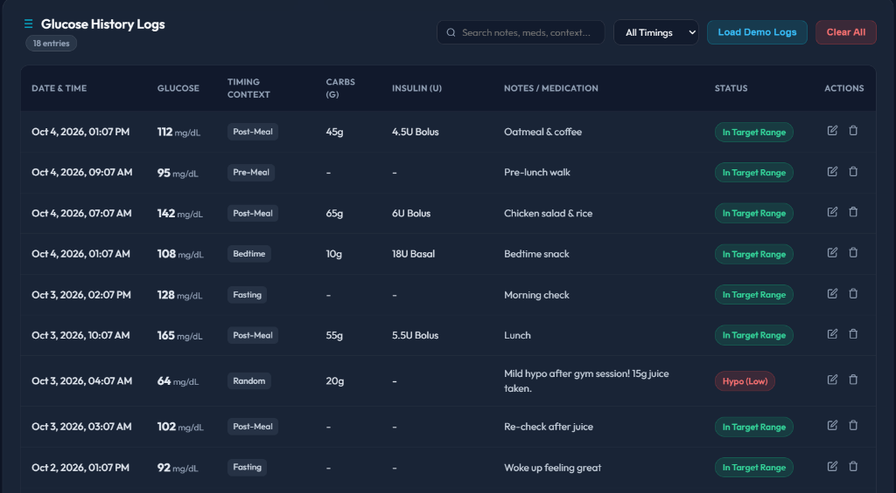

# 🩸 GlucoPulse - Blood Sugar Monitor App

GlucoPulse is a simple, private blood sugar tracker for people managing **Type 1** and **Type 2 diabetes**. It lets you log readings, see trends, and export your history to share with your doctor. No account or sign-up is needed.

**Live app:** https://gluco-pulse.vercel.app/



**Project journal:** [journal.md](journal.md)

---

## What the project is
A web app that records blood sugar readings with their context (fasting, before a meal, after a meal, bedtime, and so on). For Type 1 users it also records carbs and insulin. For Type 2 users it records medication and physical activity. It turns the readings into an average, an estimated A1C, a Time in Range percentage, and a trend chart.

## The problem it solves
Tracking blood sugar on paper or from memory leads to lost entries, missed patterns, and inaccurate recall during doctor visits. Without trends or summary numbers such as Time in Range, it is hard to spot post-meal spikes or repeated low readings. Many digital trackers also require an account before you can save a single reading.

## Who it's for
Adults living with Type 1 or Type 2 diabetes who check their blood sugar at home with a glucometer and want a quick, private digital record to review and share with their doctor.

## Tools and technologies
| Tool | Used for |
|---|---|
| HTML5 | Page structure and form inputs |
| CSS3 (no framework) | Layout, responsive design, styling |
| JavaScript (ES6) | App logic, browser storage, chart drawing, CSV/JSON export |
| Anti Gravity + AI agent | Writing the first version of the code and running Git steps |
| Git | Saving versions of the code (commits) |
| GitHub | Online backup and public record of the project |
| Vercel | Hosting, so the app is live on the internet |

## Features
- **Two glucose units:** switch between `mg/dL` and `mmol/L`, with automatic conversion.
- **Type 1 tracking:** rapid-acting (bolus) and long-acting (basal) insulin, plus carbohydrates in grams.
- **Type 2 tracking:** oral medication notes and physical activity level.
- **Low-reading alert:** shows the 15-15 rule guidance when a reading falls below the low limit (default 70 mg/dL, adjustable in settings).
- **Trend chart:** colour-coded readings with a shaded target range, over 7 days, 14 days, 30 days or all time.
- **Estimated A1C (eAG):** calculated from your average using the standard formula `A1C = (average mg/dL + 46.7) / 28.7`. It is an estimate, not a lab result.
- **Time in Range:** the percentage of readings inside your target range.
- **History tools:** filter by timing, search notes, add, edit and delete entries.
- **Export and backup:** download a CSV to share with your doctor, or a JSON file to back up and restore your data.

## Decisions I made and why
1. **Browser storage instead of a database with accounts.**
   Health data stays on the user's own device, and there is nothing to sign up for.
   *Alternative:* a server with logins.
   *Trade-off:* data lives on one device only, and clearing the browser deletes it. That is why I added JSON backup and CSV export.
2. **One app for both Type 1 and Type 2.**
   Both types need the same core action (log a reading with context). Optional fields for insulin and carbs (Type 1) and medication and activity (Type 2) avoid building two separate apps.
3. **mg/dL and mmol/L both supported.**
   Different regions use different units (mg/dL in the US, mmol/L in many other countries). A unit switch makes the app usable without manual conversion.
4. **Plain HTML, CSS and JavaScript, no frameworks.**
   It keeps the project simple and lightweight, needs no build step, and deploys in seconds.
5. **A medical disclaimer and no dosing advice.**
   The app tracks and informs. It does not give medical recommendations, because dosing decisions need a doctor.

## Challenges and how I solved them
1. **The form rejected normal mmol/L readings.**
   The input boxes had fixed minimum values (10 and 40) that suit mg/dL but block mmol/L values, which are much smaller (a normal reading is around 5). *Fix:* I changed the limits to allow smaller values and made the placeholders and target range labels change with the selected unit.
2. **Understanding the Git workflow.**
   I confused the steps `git init`, `git add`, `git commit`, `git remote add` and `git push`. *Solution:* I learned they are separate steps. Initialise switches on tracking, add stages files, commit saves a snapshot on my computer, remote add connects the GitHub repo, and push sends the snapshots to GitHub.
3. **A command that worked differently in PowerShell.**
   `&&` (used to chain commands) did not work in PowerShell. *Solution:* I used `;` instead.

## Known limitations
- Data lives on one device and browser only
- Data is not encrypted
- No accounts or syncing across devices
- Readings are entered by hand (no connection to continuous glucose monitors yet)

## What's next
- Downloadable PDF report for doctor visits
- Test the app with real users and improve it from their feedback
- Reminder notifications for a 2-hour after-meal re-check

## Run it yourself
1. Clone this repository:
```bash
   git clone https://github.com/obithelight/GlucoPulse.git
```
2. Open `index.html` in any web browser. No install or build step is needed.

## Medical disclaimer
*This application is for tracking and informational purposes only. It does not provide medical advice, diagnosis, or treatment recommendations. Always consult your doctor or endocrinologist before adjusting your medication or insulin dosages.*